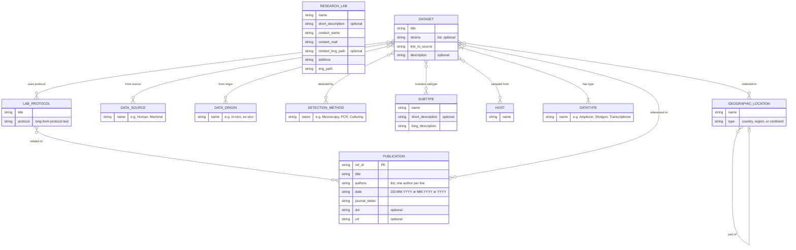

# Datastructure

Here is a short overview of the datastructure form BlastoDB:

```mermaid
erDiagram
    LAB_PROTOCOL {
        string title
        string protocol "long-form protocol text"
    }
    DATA_SOURCE {
        string name "e.g. Human, Mammal"
    }
    DATA_ORIGIN {
        string name "e.g. in-vivo, ex-vivo"
    }
    DETECTION_METHOD {
        string name "e.g. Microscopy, PCR, Culturing"
    }
    SUBTYPE {
        string name
        string short_description "optional"
        string long_description
    }
    HOST {
        string name
    }
    DATATYPE {
        string name "e.g. Amplicon, Shotgun, Transcriptome"
    }
    RESEARCH_LAB {
        string name
        string short_description "optional"
        string contact_name
        string contact_mail
        string contact_img_path "optional"
        string address
        string img_path
    }
    PUBLICATION {
        string ref_id PK
        string title
        string authors "list; one author per line"
        string date "DD.MM.YYYY or MM.YYYY or YYYY"
        string journal_name
        string doi "optional"
        string url "optional"
    }
    GEOGRAPHIC_LOCATION {
        string name
        string type "country, region, or continent"
    }
    DATASET {
        string title
        string strains "list, optional"
        string link_to_source
        string description "optional"
    }

    GEOGRAPHIC_LOCATION }o--o| GEOGRAPHIC_LOCATION : "part of"

    LAB_PROTOCOL }o--o{ PUBLICATION : "related to"

    DATASET }|--|{ DATATYPE : "has type"
    DATASET }o--o{ DATA_ORIGIN : "from origin"
    DATASET }o--o{ DATA_SOURCE : "from source"
    DATASET }o--o{ DETECTION_METHOD : "detected by"
    DATASET }o--o{ SUBTYPE : "contains subtype"
    DATASET }o--o{ HOST : "sampled from"
    DATASET }o--o{ PUBLICATION : "referenced in"
    DATASET }o--o{ LAB_PROTOCOL : "uses protocol"
    DATASET }o--o{ GEOGRAPHIC_LOCATION : "collected in"
```
